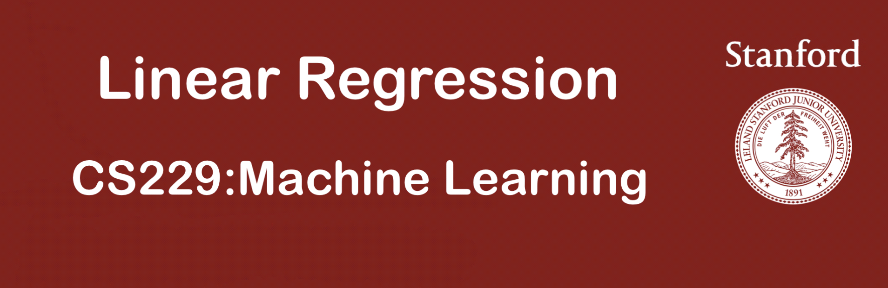
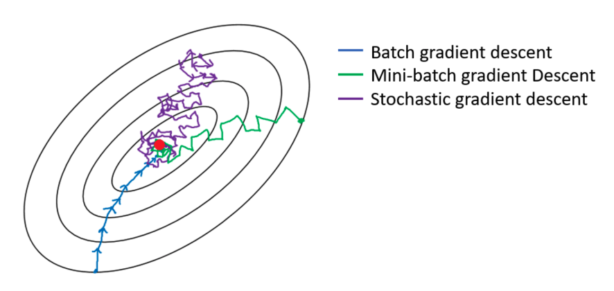

## 线性回归的模型函数和损失函数

线性回归是⼀种 **「监督学习」(superviesed learning)** 算法，即给定⼀个训练集，去学习⼀个假设函数，⽤来尽量精确地预测每个样本对应的输出。从输出变量的离散程度来看，监督学习算法可以分为两类。线性回归属于回归算法，其输出变量 **「连续」** ；而另⼀类监督学习算法是分类算法，其输出变量离散。

线性回归的假设函数为：

$$h_{\theta}(x)=\sum_{i=0}^n \theta_i x_i = x \theta$$

其中；$\theta=\begin{bmatrix}
   \theta_0 \\
   \theta_1  \\
   \vdots \\
   \theta_n
  \end{bmatrix}, x^{(i)}=\begin{bmatrix}
   1  \\
   x_1^{(i)} \\
   \vdots \\
   x_n^{(i)}
  \end{bmatrix}^T,i=1,\cdots,m ,X=\begin{bmatrix}
{1}&{x_1^{(1)}}&{\cdots}&{x_n^{(1)}}\\
{1}&{x_1^{(2)}}&{\cdots}&{x_n^{(2)}}\\
{\vdots}&{\vdots}&{\ddots}&{\vdots}\\
{1}&{x_1^{(m)}}&{\cdots}&{x_n^{(m)}}\\
\end{bmatrix}$

线性回归的代价函数为：

$$J(\theta)=\frac{1}{2}\sum_{i=1}^m \big(h_{\theta}(x^{(i)})-y^{(i)}\big)^2$$

$m$ 个样本，每个样本有 $n$ 个特征。

进一步用矩阵形式表达损失函数:

$$J(\theta)=\frac{1}{2}(X\theta-Y)^T (X\theta - Y)$$

线性回归的学习目标：通过训练集找出使代价函数最小的一组参数 $\theta$（又称 **最小二乘法LMS algorithm(least mean squares)** ）.

## 求解方法

对于线性回归代价函数的求解，有两种可选⽅法：**「梯度下降(gradient descent)」** 与 **「正规方程(normal equations)」** 。

### 2.1 梯度下降

梯度下降是⼀种求解最优化问题的迭代⽅法，具体步骤为：

1. 随机选取初始的 $\theta$

2. 不断地以梯度的方向修正 $\theta$

3. 最终使 $J(\theta)$ 收敛至局部最优（在最小二乘中，局部最优即全局最优）

$$\theta_j:= \theta_j - \alpha \frac{\partial}{\partial \theta_j}J(\theta)$$

用矩阵形式表达为：

$$\theta = \theta - \alpha X^T(X\theta-Y)$$

$\alpha$ 称为学习率(learning rate)，太小会导致收敛缓慢，太大会导致错过最优点，需要谨慎选择。

对公式进一步推导（假设只有一个样本点），得到：

$$\frac{\partial}{\partial \theta_j}J(\theta)=\frac{\partial}{\partial \theta_j} \frac{1}{2}\big(h_{\theta}(x)-y\big)^2$$

$$=\big(h_{\theta}(x)-y\big)\cdot \frac{\partial}{\partial \theta_j}(\sum_{i=0}^n \theta_i x_i - y)$$

$$=\big(h_{\theta}(x) - y\big)x_j$$

将上述结果代回公式得到：

$$\theta_j:=\theta_j + \alpha \big(y^{(i)}-h_{\theta}(x^{(i)})\big) x_j^{(i)}$$

矩阵表达方式：

$$\theta:= \theta + \alpha X^T(Y-X\theta)$$

注意公式中通过数学变换将减号变成了加号， 方便之后与逻辑回归的结果作比较.

#### 2.1.1 分类

梯度下降主要可以分为两类：**「批量梯度下降(Batch gradient descent)」**、**「小批量随机下降(MBGD)」** 和 **「随机梯度下降(Stochastic gradient descent)」** ：

知识点补充：

* 批量梯度下降(Batch Gradient Descent，BGD)

使用整个训练集的优化算法被称为批量(batch)或确定性(deterministic)梯度算法，因为它们会在一个大批量中同时处理所有样本。

批量梯度下降法是最原始的形式，它是指在每一次迭代时使用所有样本来进行梯度的更新。具体的算法可以参考我之前的文章——温故知新——梯度下降。

优点：

（1）在训练过程中，使用固定的学习率，不必担心学习率衰退现象的出现。

（2）由全数据集确定的方向能够更好地代表样本总体，从而更准确地朝向极值所在的方向。当目标函数为凸函数时，一定能收敛到全局最小值，如果目标函数非凸则收敛到局部最小值。

（3）它对梯度的估计是**无偏**的。样例越多，标准差越低。

（4）一次迭代是对所有样本进行计算，此时利用向量化进行操作，实现了并行。

缺点：

（1）尽管在计算过程中，使用了向量化计算，但是遍历全部样本仍需要大量时间，尤其是当数据集很大时（几百万甚至上亿），就有点力不从心了。

（2）每次的更新都是在遍历全部样例之后发生的，这时才会发现一些例子可能是多余的且对参数更新没有太大的作用。

* 随机梯度下降(Stochastic Gradient Descent，SGD)

随机梯度下降法不同于批量梯度下降，随机梯度下降是在每次迭代时使用一个样本来对参数进行更新（mini-batch size =1）。

对于一个样本的损失函数为：

$$J^{(i)}(\theta_0,\theta_1)=\frac{1}{2}(h_{\theta}(x^{(i)})-y^{(i)})^2$$

计算损失函数的梯度：

$$\frac{\partial J^{(i)}(\theta_0,\theta_1)}{\partial \theta_j}=(h_{\theta}(x^{(i)})-y^{(i)})x_j^{(i)}$$

参数更新：

$$\theta_j:=\theta_j-\alpha(h_{\theta}(x^{(i)})-y^{(i)})x_j^{(i)}$$

优点：

（1）在学习过程中加入了噪声，提高了泛化误差。

（2）由于不是在全部训练数据上的损失函数，而是在每轮迭代中，随机优化某一条训练数据上的损失函数，这样每一轮参数的更新速度大大加快。

缺点：

（1）不收敛，在最小值附近波动。

（2）不能在一个样本中使用向量化计算，学习过程变得很慢。

（3）单个样本并不能代表全体样本的趋势。

（4）当遇到局部极小值或鞍点时，SGD会卡在梯度为0处。

* 小批量梯度下降(Mini-batch Gradient Descent，MBGD)

大多数用于深度学习的梯度下降算法介于以上两者之间，使用一个以上而又不是全部的训练样本。传统上，这些会被称为小批量(mini-batch)或小批量随机(mini-batch stochastic)方法，现在通常将它们简单地成为随机(stochastic)方法。对于深度学习模型而言，人们所说的“随机梯度下降, SGD”，其实就是**基于小批量（mini-batch）的随机梯度下降**。

什么是小批量梯度下降？具体的说：在算法的每一步，我们从具有 $m$ 个样本的训练集（已经打乱样本的顺序）中随机抽出一小批量(mini-batch)样本 $X=(x^{1),...,x^{(m')}})$ 。小批量的数目 $m'$ 通常是一个相对较小的数（从1到几百）。重要的是，当训练集大小 $m$ 增长时，$m'$ 通常是固定的。我们可能在拟合几十亿的样本时，每次更新计算只用到几百个样本。

$m'$ 个样本的损失函数为：

$$J(\theta)=\frac{1}{2m'}\sum_{i=1}^{m'} \big(h_{\theta}(x^{(i)})-y^{(i)}\big)^2$$

计算损失函数的梯度：

$$g = \frac{\partial}{\partial \theta_j}J(\theta)=\frac{1}{m'}\sum_{i=1}^{m'}\big(h_{\theta}(x^{(i)}) - y\big)x_j^{(i)}$$

参数更新：

$$\theta_j:=\theta_j-\alpha g$$

mini-batch的SGD算法中一个关键参数是学习率。在实践中，有必要随着时间的推移逐渐降低学习率—学习率衰减(learning rate decay)。

为什么要进行学习率衰减呢？

在梯度下降初期，能接受较大的步长（学习率），以较快的速度进行梯度下降。当收敛时，我们希望步长小一点，并且在最小值附近小幅摆动。假设模型已经接近梯度较小的区域，若保持原来的学习率，只能在最优点附近徘徊。如果降低学习率，目标函数能够进一步降低，有助于算法的收敛，更容易接近最优解。

常用的学习率衰减的方法：

$$\alpha=\frac{\alpha_0}{1+\beta^* \lambda}$$

$$\alpha = 0.95^{\lambda *}\alpha_0$$

$$\alpha = \frac{k}{\sqrt{\lambda}}\alpha_0$$

$$\alpha=\frac{k}{\text{mini-batch size}}\alpha_0$$

其中 $\beta$ 为衰减率，$\lambda$ 为epoch数量，$k$ 为常数，$\alpha_0$ 为初始学习率

##### 小批量大小（mini-batch size）通常由以下几个因素决定：（引自“AI圣经—花书”）

（1）更大的批量会计算更精确的梯度，但是回报却是小于线性的。

（2）极小的批量通常难以充分利用多核结构。当批量低于某个数值时，计算时间不会减少。

（3）批量处理中的所有样本可以并行处理，内存消耗和批量大小会成正比。对于很多硬件设备，这是批量大小的限制因素。

（4）在使用GPU时，通常使用2的幂数作为批量大小可以获得更少的运行时间。一般，2的幂数取值范围是32~256。16有时在尝试大模型时使用。

在一定范围内，一般来说 Batch_Size 越大，其确定的下降方向越准，引起训练震荡越小。跑完一次 epoch（全数据集）所需的迭代次数减少，对于相同数据量的处理速度进一步加快，但是要想达到相同的精度，其所花费的时间大大增加了，从而对参数的修正也就显得更加缓慢。当Batch_Size 增大到一定程度，其确定的下降方向已经基本不再变化，也可能会超出内存容量。

优点：

（1）计算速度比Batch Gradient Descent快，因为只遍历部分样例就可执行更新。

（2）随机选择样例有利于避免重复多余的样例和对参数更新较少贡献的样例。

（3）每次使用一个batch可以大大减小收敛所需要的迭代次数，同时可以使收敛到的结果更加接近梯度下降的效果。

缺点：

（1）在迭代的过程中，因为噪音的存在，学习过程会出现波动。因此，它在最小值的区域徘徊，不会收敛。

（2）学习过程会有更多的振荡，为更接近最小值，需要增加学习率衰减项，以降低学习率，避免过度振荡。

（3）batch_size的不当选择可能会带来一些问题。

#### 2.1.2 梯度方向的选择

选择梯度⽅向的原因是它是使代价函数减小（下降）最大的方向，我们可以利用柯西不等式对这一结论进行证明：

当 $\theta$ 改变一个很小的量时，利用泰勒公式，忽略一阶导数之后的项，得：

$$\Delta J \approx \frac{\partial J}{\partial \theta_0} \Delta \theta_0 + \frac{\partial J}{\partial \theta_1} \Delta \theta_1+...+\frac{\partial J}{\partial \theta_n} \Delta \theta_n$$

定义如下变量：

$$\Delta \theta = (\Delta \theta_0,\Delta \theta_1,...\Delta \theta_n)^T$$

$$\triangledown J =\Big(\frac{\partial J}{\partial \theta_0},\frac{\partial J}{\partial \theta_1},...,\frac{\partial J}{\partial \theta_n}\Big)^T$$

将其代回上式，得:

$$\Delta J \approx \triangledown J \cdot \Delta \theta$$

根据柯西不等式，有（等号当且仅当 $\Delta \theta$ 与 $\triangledown J$ 线性相关时成立）：

$$|\Delta J| \approx |\triangledown J \cdot \Delta \theta| \leq \parallel \triangledown J \parallel \cdot \parallel \Delta \theta \parallel $$

因此，要使 $\Delta J$ 最小，即 $|\Delta J|$ 最大且 $\Delta J < 0$，而当且仅当 $\Delta \theta = -\alpha \triangledown J(\alpha > 0)$ 时满足条件，即沿着梯度方向调整 $\theta$ 。

### 2.2 最小二乘法

线性回归的假设函数为：

$$h_{\theta}(x)=\sum_{i=0}^n \theta_i x_i = x\theta$$

其中；$\theta=\begin{bmatrix}
   \theta_0 \\
   \theta_1  \\
   \vdots \\
   \theta_n
  \end{bmatrix}, x=\begin{bmatrix}
   1  \\
   x_1 \\
   \vdots \\
   x_n
  \end{bmatrix}$ 

线性回归的代价函数为：

$$J(\theta)=\frac{1}{2}\sum_{i=1}^m \big(h_{\theta}(x^{(i)})-y^{(i)}\big)^2$$

$m$ 个样本，每个样本有 $n$ 个特征。

进一步用矩阵形式表达损失函数:

$$J(\theta)=\frac{1}{2}(X \theta-Y)^T (X \theta - Y)$$

根据最小二乘法的原理，我们要对这个损失函数对 $\theta$ 向量求导取0。结果如下式：

$$\frac{\partial}{\partial \theta}J(\theta)=X^T(X\theta-Y)$$

这里面用到了矩阵求导链式法则，和两个个矩阵求导的公式。

公式1：$\frac{\partial}{\partial x}(x^T x)=2x$, $x$ 为向量

公式2：$\triangledown_X f(AX+B)=A^T \triangledown_Y f, Y=AX+B,f(Y) $为标量。

对上述求导等式整理后可得：

$$X^TX \theta = X^T = Y$$

两边同时左乘 $(X^T X)^{-1}$可得：

$$\theta=(X^T X)^{-1}X^T Y$$

这样我们就一下子求出了 $\theta$ 向量表达式的公式，免去了代数法一个个去求导的麻烦。只要给了数据,我们就可以用 $\theta=(X^T X)^{-1}X^T Y$ 算出$\theta$。

#### 最小二乘法的局限性和适用场景　
　
从上面可以看出，最小二乘法适用简洁高效，比梯度下降这样的迭代法似乎方便很多。但是这里我们就聊聊最小二乘法的局限性。

首先，最小二乘法需要计算 $X^T X$ 的逆矩阵，有可能它的逆矩阵不存在，这样就没有办法直接用最小二乘法了，此时梯度下降法仍然可以使用。当然，我们可以通过对样本数据进行整理，去掉冗余特征。让 $X^T X$ 的行列式不为0，然后继续使用最小二乘法。

第二，当样本特征n非常的大的时候，计算 $X^T X$ 的逆矩阵是一个非常耗时的工作（nxn的矩阵求逆），甚至不可行。此时以梯度下降为代表的迭代法仍然可以使用。那这个n到底多大就不适合最小二乘法呢？如果你没有很多的分布式大数据计算资源，建议超过10000个特征就用迭代法吧。或者通过**主成分分析**降低特征的维度后再用最小二乘法。

第三，如果拟合函数不是线性的，这时无法使用最小二乘法，需要通过一些技巧转化为线性才能使用，此时梯度下降仍然可以用。

第四，讲一些特殊情况。当样本量m很少，小于特征数n的时候，这时拟合方程是欠定的，常用的优化方法都无法去拟合数据。当样本量m等于特征数n的时候，用方程组求解就可以了。当m大于n时，拟合方程是超定的，也就是我们常用与最小二乘法的场景了。

## 线性回归的推广：多项式回归

回到我们开始的线性模型，$h_{\theta}(x_1,x_2,\cdots,x_n)=\theta_0+\theta_1 x_1+...+\theta_n x_n$, 如果这里不仅仅是x的一次方，比如增加二次方，那么模型就变成了多项式回归。这里写一个只有两个特征的二次方多项式回归的模型：

$$h_{\theta}(x_1, x_2)=\theta_0+\theta_1 x_1+\theta_2 x_2+\theta_3 x_1^2 + \theta_4 x_2^2+\theta_5 x_1 x_2$$

我们令 $x_0=1,x_1=x_1,x_2=x_2,x_3=x_1^2,x_4=x_2^2,x_5=x_1 x_2$, 这样我们就得到了下式：

$$h_{\theta}(x_1,x_2)=\theta_0 x_0+\theta_1 x_1+\theta_2 x_2 + \theta_3 x_3 + \theta_4 x_4+\theta_5 x_5$$
　　　　
可以发现，我们又重新回到了线性回归，这是一个五元线性回归，可以用线性回归的方法来完成算法。对于每个二元样本特征 $(x_1, x_2)$,我们得到一个五元样本特征 $(1,x_1,x_2,x_1^2,x_2^2,x_1x_2)$，通过这个改进的五元样本特征，我们重新把不是线性回归的函数变回线性回归。

## 线性回归的推广：广义线性回归

在上一节的线性回归的推广中，我们对样本特征端做了推广，这里我们对于特征 $y$ 做推广。比如我们的输出 $Y$ 不满足和 $X$ 的线性关系，但是 $\text{ln}Y$ 和 $X$ 满足线性关系，模型函数如下：

$$\text{ln}Y = X\theta$$

这样对与每个样本的输入 $y$，我们用 $\text{ln}y$ 去对应， 从而仍然可以用线性回归的算法去处理这个问题。我们把 $\text{ln}y$ 一般化，假设这个函数是**单调可微函数** $g(\cdot)$,则一般化的广义线性回归形式是：

$g(Y)=X\theta$ 或者 $Y=g^{-1}(X\theta)$

这个函数𝐠(.)我们通常称为联系函数。

## 线性回归的正则化
　　　　
为了防止模型的过拟合，我们在建立线性模型的时候经常需要加入正则化项。一般有 $L_1$ 正则化和 $L_2$ 正则化。

线性回归的 $L1$ 正则化通常称为**Lasso回归**，它和一般线性回归的区别是在损失函数上增加了一个 $L_1$ 正则化的项，$L_1$ 正则化的项有一个常数系数 $\alpha$ 来调节损失函数的均方差项和正则化项的权重，具体Lasso回归的损失函数表达式如下：　　

$$J(\theta)=\frac{1}{2}(X\theta-Y)^T (X\theta-Y)+\alpha \parallel \theta \parallel_1$$

其中n为样本个数，$\alpha$ 为常数系数，需要进行调优。$\parallel \theta \parallel_1$ 为 $L_1$ 范数。

 Lasso回归可以使得一些特征的系数变小，甚至还使一些绝对值较小的系数直接变为0。增强模型的泛化能力。

 Lasso回归的求解办法一般有坐标轴下降法（coordinate descent）和最小角回归法（ Least Angle Regression），由于它们比较复杂，在我的这篇文章单独讲述： 线程回归的正则化-Lasso回归小结

 线性回归的 $L_2$ 正则化通常称为Ridge回归，它和一般线性回归的区别是在损失函数上增加了一个 $L_2$ 正则化的项，和Lasso回归的区别是Ridge回归的正则化项是 $L_2$ 范数，而Lasso回归的正则化项是 $L_1$ 范数。具体Ridge回归的损失函数表达式如下：

$$J(\theta)=\frac{1}{2}(X\theta-Y)^T (X\theta-Y)+\alpha \parallel \theta \parallel_2$$

其中n为样本个数，$\alpha$ 为常数系数，需要进行调优。$\parallel \theta \parallel_2$ 为 $L_2$ 范数。

Ridge回归在不抛弃任何一个特征的情况下，缩小了回归系数，使得模型相对而言比较的稳定，但和Lasso回归比，这会使得模型的特征留的特别多，模型解释性差。

 Ridge回归的求解比较简单，一般用最小二乘法。这里给出用最小二乘法的矩阵推导形式，和普通线性回归类似。

令 $J(\theta)$ 的导数为0，得到下式：

$$X^T(X\theta - Y)+\alpha \theta = 0$$
　　　　
整理即可得到最后的 $\theta$ 的结果：

$$\theta= (X^T X+\alpha E)^{-1}X^T Y$$

其中E为单位矩阵。

除了上面这两种常见的线性回归正则化，还有一些其他的线性回归正则化算法，区别主要就在于正则化项的不同，和损失函数的优化方式不同，这里就不累述了。