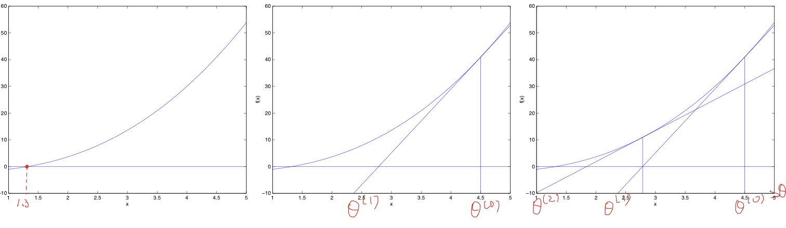

之前我们讨论的是 **「回归问题」**，即输出是连续值，现在我们来讨论输出是离散值的 **「分类问题」**。本节我们将专注于「二元分类」问题，即输出$y$ 只能取0 和1 两个值。

### 1 逻辑回归(Logistic Regression)

如果将线性回归模型直接应用于分类问题，会产生取值不在 0 和 1 之间的问题，所以我们引入 **「逻辑回归模型」**：

$$h_{\theta}(x)= g(x) = \frac{1}{1+e^{-\theta^{T}x}}$$

其中

$$g(x) = \frac{1}{1+e^{-x}}$$

$g(z)$ 被称为 **「逻辑函数」** 或 **「S 型函数」**，其图像如下：


这里先给出一个关于 S 型函数求导的有用性质：

$$\begin{align*}
g(z)'&=\left(\frac{1}{1+e^{-z}}\right)'=\frac{e^{-z}}{(1+e^{-z})^2} \newline &=\left(\frac{1}{1+e^{-z}}\right)\left(\frac{e^{-z}}{1+e^{-z}}\right)=g(z)\left(\frac{+1-1 + e^{-x}}{1+e^{-x}}\right)=g(z)\left(\frac{1 + e^{-z}}{1+e^{-z}} - \frac{1}{1+e^{-z}}\right)\\
&=g(z)(1 - g(z))\\
\end{align*}$$

确定了模型之后，我们需要找到合适的 $\theta$ 的值。这里采用之前使用的 **「最大似然法」** 来选择参数（假设函数可以直接看作概率分布）。

首先，二元分类符合「伯努利分布」，我们假设：

$$P(y=1|x;\theta)=h_{\theta}(x)$$

$$P(y=0|x;\theta)=1-h_{\theta}(x)$$

将上面的公式合二为一，得到：

$$P(y|x;\theta)=\big(h_{\theta}(x)\big)^y (1-h_{\theta}(x))^{1-y}$$

假定$m$个样本之间相互独立，我们可以得到 $\theta$ 的似然函数如下：

$$L(\theta)=p(\vec y|X;\theta)=\prod_{i=1}^m p(y^{(i)}|x^{(i)};\theta)=\prod_{i=1}^m \big(h_{\theta}(x^{(i)})\big)^{y^{(i)}}\big(1-h_{\theta}(x^{(i)})\big)^{1-y^{(i)}}$$

下面要做的是找到 $\theta$ 使得 $l(\theta)$ 最大，由于这里是找最大值而非最小值，所以使用 **「梯度上升」**（gradient ascent), 为了计算方便，我们使用对数似然函数取反的表达式，即损失函数的表达式：

$$J(\theta)=-\ell(\theta)=-\text{log}L(\theta)=-\sum_{i=1}^m y^{(i)} \text{log} h(x^{(i)})+\big(1-y^{(i)}\big)\text{log}\big(1-h(x^{(i)})\big)$$

损失函数用矩阵法表达更加简洁：

$$J(\theta)=-Y^T \text{log} h_{\theta}(X)-(E-Y)^T\text{log}(E-h_{\theta}(X))$$

参数的更新规则是 $\theta:=\theta+\alpha \triangledown_{\theta} l(\theta)$，对于随机梯度上升（每次只考虑一个样本），求导过程如下：

$$\begin{aligned}
\frac{\partial}{\partial \theta_j}\ell(\theta)&=\Big(y\frac{1}{g(\theta^T x)}-(1-y)\frac{1}{1-g(\theta)^T x}\Big)\frac{\partial}{\partial \theta_j}g(\theta^T x)\\
&=\Big(y\frac{1}{g(\theta^T x)}-(1-y)\frac{1}{1-g(\theta)^T x}\Big)g(\theta^Tx)\big(1-g(\theta^Tx)\big)\frac{\partial}{\partial \theta_j}\theta^T x \\
&=\big(y(1-g(\theta^T x))-(1-y)g(\theta^T x)\big)x_j \\
&=(y-h_{\theta}(x))x_j
\end{aligned}$$

综上所述，我们得到的随机梯度上升的更新规则为：

$$\theta_j:=\theta_j+\alpha\big(y^{(i)}-h_{\theta}(x^{(i)})\big)x_j^{(i)}$$

用矩阵表达为：

$$\theta = \theta - \alpha X^T(h_{\theta}(X)-Y)$$

这个公式和线性回归中梯度下降的公式表面上看是一样的，但实际上两者的 $h_{\theta}(x)$ 有所不同，关于更加深层次的讨论，请参看之后的 GLM 模型章节。

逻辑回归代码实现:

```

```

### 2 牛顿方法

下面我们介绍另外一种算法来求解 $\ell(\theta)$ 的最大值，称为 **「牛顿方法(Newton's method)」**。我们可以通过如下的几张图来理解牛顿方法：



对于梯度下降，每次只是在梯度方向上下降一小步（取决于学习速率），而牛顿方法是一直下降到「导数」（切线）和$\theta$轴交界的那个$\theta$。因此牛顿方法的更新规则是：

$$\theta:=\theta - \frac{f(\theta)}{f'(\theta)}$$

下面我们将牛顿方法应用于逻辑回归，我们需要找到 $l(\theta)$ 的最大值，即 $l'(\theta)=0$，因此令 $f(\theta)=\ell'(\theta)$，我们可以得到逻辑回归的牛顿方法更新公式：

$$\theta:=\theta - \frac{\ell'(\theta)}{\ell''(\theta)}$$

而对于 $\theta$ 为向量的情况，牛顿方法的多维形式如下（又被称为 **「牛顿-拉夫逊方法(Newton-Raphson method)」**）：

$$\theta:=\theta-H^{-1} \triangledown_{\theta}\ell(\theta)$$

其中 $\triangledown_{\theta}\ell(\theta)$ 是 $l(\theta)$ 对于每个 $\theta_i$ 的偏导数构成的向量。$H$ 是一个 $(n+1)\times (n+1)$ 的矩阵（包括截距项），称为 **「海森矩阵(Hessian matrix)」**，其中的每一项定义为：

$$H_{ij}=\frac{\partial^2 \ell(\theta)}{\partial \theta_i \partial \theta_j}$$

### 3. 二元逻辑回归的正则化

逻辑回归也会面临过拟合问题，所以我们也要考虑正则化。常见的有 $L_1$ 正则化和 $L_2$ 正则化。

逻辑回归的 $L_1$ 正则化的损失函数表达式如下，相比普通的逻辑回归损失函数，增加了 $L_1$ 的范数做作为惩罚，超参数 $\alpha$ 作为惩罚系数，调节惩罚项的大小。

二元逻辑回归的 $L_1$ 正则化损失函数表达式如下：

$$J(\theta)=-Y^T \text{log} h_{\theta}(X)-(E-Y)^T\text{log}(E-h_{\theta}(X))+\alpha \parallel\theta \parallel_1$$

其中 $\parallel\theta \parallel_1$ 为 $\theta$ 的 $L_1$范数。

逻辑回归的 $L_1$ 正则化损失函数的优化方法常用的有坐标轴下降法和最小角回归法。

二元逻辑回归的 $L_2$ 正则化损失函数表达式如下：

$$J(\theta)=-Y^T \text{log} h_{\theta}(X)-(E-Y)^T\text{log}(E-h_{\theta}(X))+\alpha \parallel\theta \parallel_2$$
　　　　
其中 $\parallel\theta \parallel_2$ 为 $\theta$ 的 $L_2$ 范数。

逻辑回归的 $L_2$ 正则化损失函数的优化方法和普通的逻辑回归类似。

### 4. 二元逻辑回归的推广：多元逻辑回归

前面几节我们的逻辑回归的模型和损失函数都局限于二元逻辑回归，实际上二元逻辑回归的模型和损失函数很容易推广到多元逻辑回归。比如总是认为某种类型为正值，其余为0值，这种方法为最常用的one-vs-rest，简称OvR.

另一种多元逻辑回归的方法是Many-vs-Many(MvM)，它会选择一部分类别的样本和另一部分类别的样本来做逻辑回归二分类。最常用的是One-Vs-One（OvO）。OvO是MvM的特例。每次我们选择两类样本来做二元逻辑回归。

这里只介绍多元逻辑回归的softmax回归的一种特例推导：

首先回顾下二元逻辑回归。

$$P(y=1|x,\theta)=h_{\theta}(x)=\frac{1}{1+e^{-x\theta}}=\frac{e^{x\theta}}{1+e^{x\theta}}$$
$$P(y=0|x,\theta)=1-h_{\theta}(x)=\frac{1}{1+e^{x\theta}}$$
　　　
其中 $y$ 只能取到 $0$ 和 $1$。则有：

$$\text{ln}\frac{P(y=1|x,\theta)}{P(y=0|x,\theta)}=x\theta$$

如果我们要推广到多元逻辑回归，则模型要稍微做下扩展。

我们假设是 $K$ 元分类模型,即样本输出 $y$ 的取值为 $1,2,\cdots,K$。

根据二元逻辑回归的经验，我们有：

$$\text{ln}\frac{P(y=1|x,\theta)}{P(y=K|x,\theta)}=x\theta_1$$
$$\text{ln}\frac{P(y=2|x,\theta)}{P(y=K|x,\theta)}=x\theta_2$$　
$$\cdots$$
$$\text{ln}\frac{P(y=K-1|x,\theta)}{P(y=K|x,\theta)}=x\theta_{K-1}$$

上面有 $K-1$ 个方程。

加上概率之和为1的方程如下：

$$\sum_{i=1}^K P(y=i|x,\theta)=1$$

从而得到 $K$ 个方程，里面有K个逻辑回归的概率分布。

解出这个 $K$ 元一次方程组，得到K元逻辑回归的概率分布如下：

$$P(y=k|x,\theta)=\frac{e^{x \theta_k}}{1+\sum_{i=1}^{K-1}e^{x \theta_i}}, k=1,2,\cdots, K-1$$
$$P(y=K|x,\theta)=\frac{1}{1+\sum_{i=1}^{K-1}e^{x \theta_i}}$$
　　　　
多元逻辑回归的损失函数推导以及优化方法和二元逻辑回归类似，这里就不累述。

### 5.小结

逻辑回归尤其是二元逻辑回归是非常常见的模型，训练速度很快，虽然使用起来没有支持向量机（SVM）那么占主流，但是解决普通的分类问题是足够了，训练速度也比起SVM要快不少。如果你要理解机器学习分类算法，那么第一个应该学习的分类算法个人觉得应该是逻辑回归。理解了逻辑回归，其他的分类算法再学习起来应该没有那么难了。
