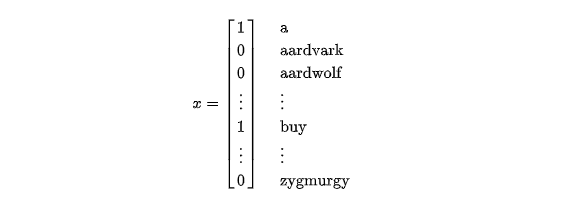
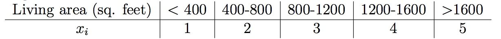
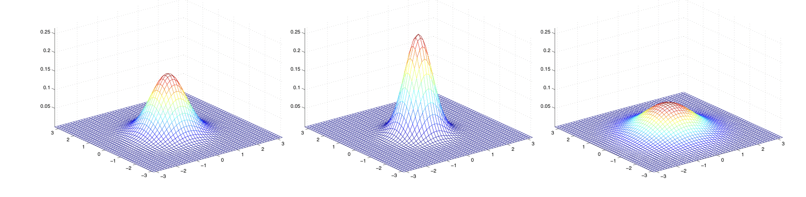
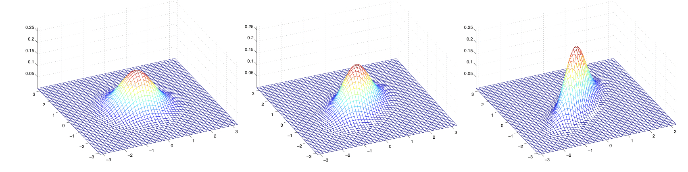
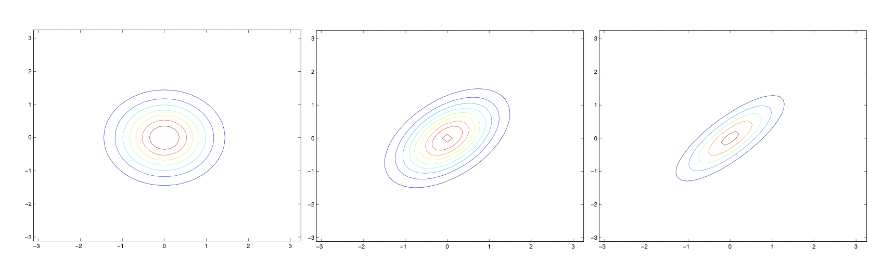
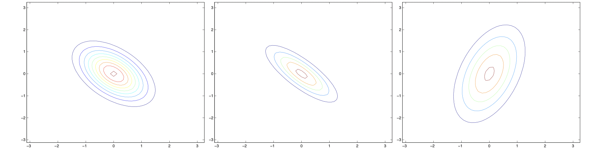
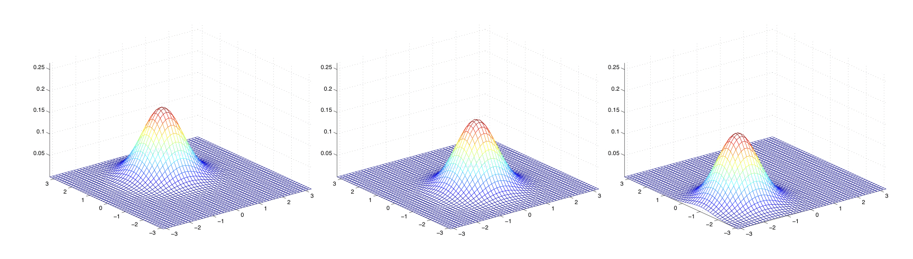
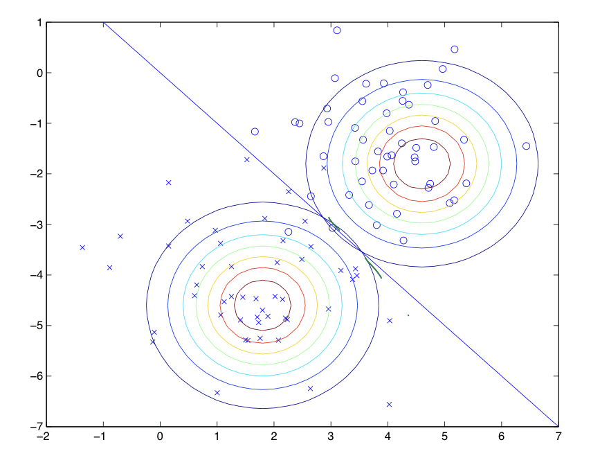

在所有的机器学习分类算法中，朴素贝叶斯和其他绝大多数的分类算法都不同。对于大多数的分类算法，比如决策树,KNN,逻辑回归，支持向量机等，他们都是判别方法，也就是直接学习出特征输出Y和特征X之间的关系，要么是决策函数𝑌=𝑓(𝑋),要么是条件分布𝑃(𝑌|𝑋)。

学习算法可分为两种，一种时尝试去直接学习得到 $p(y|x)$ (例如逻辑回归)，或者尝试去学习直接将输入映射到0或1的方法（例如感知器算法），这种算法被称为 **「判别学习算法(discriminative earning algorithm)」**；而另外一种学习算法被称为 **「生成学习算法generative learning algorithm」**，这种算法会尝试对 $p(x|y)$ 以及 $p(y)$ 建模。

但是朴素贝叶斯却是生成方法，也就是直接找出特征输出Y和特征X的联合分布 $𝑃(𝑋,𝑌)$,然后用 $𝑃(𝑌|𝑋)=𝑃(𝑋,𝑌)/𝑃(𝑋)$ 得出。

## 朴素贝叶斯算法原理小结
　　　　
当我们为 $p(y)$ (被称为 **「class priors」)** 和 $p(x|y)$ 建模后，我们的算法会使用 **「贝叶斯定理Bayes rule」** 来计算给定 $x$ 后 $y$ 的 **「后验概率(posterior distribution)」**：

$$p(y|x) = \frac{p(x|y)p(y)}{p(x)}$$

其中分母可以通过 $p(x)=p(x|y=1)p(y=1)+p(x|y=0)p(y=0)$ 得到（针对二分类）。

对于分类问题我们需要对每种 $y$ 的情况分别进行建模。当有一个新的 $x$ 时，计算每个 $y$ 的后验概率，并取概率最大的那个 $y$ 作为预测输出。

由于只需要比较大小，而 $p(x)$ 对于大家都一样，所以可以忽略分母，得到下式：

$$\underset{y}{\text{argmax}} p(y|x)=\underset{y}{\text{argmax}} \frac{p(x|y)p(y)}{p(x)}=\underset{y}{\text{argmax}}p(x|y)p(y)$$

贝叶斯学派的思想可以概括为先验概率+数据=后验概率。也就是说我们在实际问题中需要得到的后验概率，可以通过先验概率和数据一起综合得到。数据大家好理解，被频率学派攻击的是先验概率，一般来说先验概率就是我们对于数据所在领域的历史经验，但是这个经验常常难以量化或者模型化，于是贝叶斯学派大胆的假设先验分布的模型，比如正态分布，beta分布等。这个假设一般没有特定的依据，因此一直被频率学派认为很荒谬。虽然难以从严密的数学逻辑里推出贝叶斯学派的逻辑，但是在很多实际应用中，贝叶斯理论很好用，比如垃圾邮件分类，文本分类。

### 1. 朴素贝叶斯相关的统计知识

我们先看看条件独立公式，如果X和Y相互独立，则有：

$$𝑃(𝑋,𝑌)=𝑃(𝑋)𝑃(𝑌)$$

我们接着看看条件概率公式：

$$𝑃(𝑌|𝑋)=\frac{𝑃(𝑋,𝑌)}{𝑃(𝑋)}$$
$$𝑃(𝑋|𝑌)=\frac{𝑃(𝑋,𝑌)}{𝑃(𝑌)}$$

或者说:

$$𝑃(𝑌|𝑋)=\frac{𝑃(𝑋|𝑌)𝑃(𝑌)}{𝑃(𝑋)}$$

接着看看全概率公式

$P(X)=\sum_k P(X|Y=Y_k)P(Y_k)$ 其中 $\sum_k P(Y_k)=1$

从上面的公式很容易得出贝叶斯公式：

$$P(Y_k|X)=\frac{P(X|Y_k)P(Y_k)}{\sum_k P(X|Y=Y_k)P(Y_k)}$$

 ### 2. 朴素贝叶斯的模型

从统计学知识回到我们的数据分析。假如我们的分类模型样本是：

$$(x_1^{(1)},x_2^{(1)},\cdots x_n^{(1)},y_1),(x_1^{(2)},x_2^{(2)},\cdots x_n^{(2)},y_2),\cdots,(x_1^{(m)},x_2^{(m)},\cdots x_n^{(m)},y_m)$$
　　　　
即我们有m个样本，每个样本有n个特征，特征输出有K个类别，定义为$C_1,C_2,\cdots,C_K$.

从样本我们可以学习得到朴素贝叶斯的先验分布 $P(Y=C_k)(k=1,2,\cdots,K)$,接着学习到条件概率分布 $P(X_1=x_1,X_2=x_2,\cdots X_n=x_n|Y=C_k)$,然后我们就可以用贝叶斯公式得到X和Y的联合分布 $P(X,Y)$ 了。联合分布 $P(X,Y)$ 定义为：

$$\begin{aligned}
P(X,Y=C_k)&=P(Y=C_k)P(X=x|Y=C_k)\\
&=P(Y=C_k)P(X_1=x_1,X_2=x_2,\cdots X_n=x_n|Y=C_k)
\end{aligned}$$

从上面的式子可以看出 $P(Y=C_k)$ 比较容易通过最大似然法求出，得到的 $P(Y=C_k)$ 就是类别$C_k$ 在训练集里面出现的频数。但是 $P(Y=C_k)P(X_1=x_1,X_2=x_2,\cdots X_n=x_n|Y=C_k)$ 很难求出,这是一个超级复杂的有n个维度的条件分布。朴素贝叶斯模型在这里做了一个大胆的假设，即X的n个维度之间相互独立，这样就可以得出:

$$P(Y=C_k)P(X_1=x_1,X_2=x_2,\cdots X_n=x_n|Y=C_k)=P(X_1=x_1|Y=C_k)P(X_2=x_2|Y=C_k)\cdots P(X_n=x_n|Y=C_k)$$
　　　　
从上式可以看出，这个很难的条件分布大大的简化了，但是这也可能带来预测的不准确性。你会说如果我的特征之间非常不独立怎么办？如果真是非常不独立的话，那就尽量不要使用朴素贝叶斯模型了，考虑使用其他的分类方法比较好。但是一般情况下，样本的特征之间独立这个条件的确是弱成立的，尤其是数据量非常大的时候。虽然我们牺牲了准确性，但是得到的好处是模型的条件分布的计算大大简化了，这就是贝叶斯模型的选择。

最后回到我们要解决的问题，我们的问题是给定测试集的一个新样本特征 $(x_1^{(test)},x_2^{(test)},\cdots x_n^{(test)})$，我们如何判断它属于哪个类型？

既然是贝叶斯模型，当然是后验概率最大化来判断分类了。我们只要计算出所有的K个条件概率 $P(Y=C_k|X=X^{(test)})$,然后找出最大的条件概率对应的类别，这就是朴素贝叶斯的预测了。

### 3. 朴素贝叶斯的推断过程
　　　　
上节我们已经对朴素贝叶斯的模型也预测方法做了一个大概的解释，这里我们对朴素贝叶斯的推断过程做一个完整的诠释过程。

我们预测的类别 $C_{result}$ 是使 $P(Y=C_k|X=X^{(test)})$ 最大化的类别，数学表达式为：

$$\begin{aligned}
C_{result}&=\underset{C_k}{\text{argmax}} P(Y=C_k|X=X^{(test)})\\
&=\underset{C_k}{\text{argmax}} \frac{P(X=X^{(test)}|Y=C_k)P(Y=C_k)}{P(X=X^{(test)})}
\end{aligned}$$

由于对于所有的类别计算 $P(Y=C_k|X=X^{(test)})$ 时，上式的分母是一样的，都是 $P(X=X^{(test)})$，因此，我们的预测公式可以简化为：

$$\underset{C_k}{\text{argmax}}P(X=X^{(test)}|Y=C_k)P(Y=C_k)$$
　　　

接着我们利用朴素贝叶斯的独立性假设，就可以得到通常意义上的朴素贝叶斯推断公式:

$$C_{result}=\underset{C_k}{\text{argmax}}P(Y=C_k)\prod_{j=1}^n P(X_j=X_j^{(test)}|Y=C_k)$$

### 4. 朴素贝叶斯的参数估计
　　　　
在上一节中，我们知道只要求出 $P(Y=C_k)$ 和 $P(X_j=X_j^{(test)}|Y=C_k)(j=1,2,\cdots n)$，我们通过比较就可以得到朴素贝叶斯的推断结果。这一节我们就讨论怎么通过训练集计算这两个概率。

对于 $P(Y=C_k)$ ,比较简单，通过极大似然估计我们很容易得到 $P(Y=C_k)$ 为样本类别 $C_k$ 出现的频率，即样本类别 $C_k$ 出现的次数 $m_k$ 除以样本总数m。

对于 $P(X_j=X_j^{(test)}|Y=C_k)(j=1,2,\cdots n)$ ,这个取决于我们的先验条件：

a) 如果我们的 $X_j$ 是离散的值，那么我们可以假设 $X_j$ 符合多项式分布，这样得到 $P(X_j=X_j^{(test)}|Y=C_k)$ 是在样本类别 $C_k$ 中，特征 $X_j^{(test)}$ 出现的频率。即：

$$P(X_j=X_j^{(test)}|Y=C_k)=\frac{m_{kj^{test}}}{m_k}$$

其中 $m_k$ 为样本类别 $C_k$ 总的特征计数，而 $m_{kj^{test}}$ 为类别为 $C_k$ 的样本中，第j维特征 $X_j^{(test)}$ 出现的计数。

某些时候，可能某些类别在样本中没有出现，这样可能导致 $P(X_j=X_j^{(test)}|Y=C_k)$ 为0，这样会影响后验的估计，为了解决这种情况，我们引入了**拉普拉斯平滑**，即此时有：

$$P(X_j=X_j^{(test)}|Y=C_k)=\frac{m_{kj^{test}}+\lambda}{m_k+O_j \lambda}$$
　　　
其中 $\lambda$ 为一个大于0的常数，常常取为1。$O_j$ 为第j个特征的取值个数。

b)如果我们我们的 $X_j$ 是非常稀疏的离散值，即各个特征出现概率很低，这时我们可以假设 $X_j$ 符合伯努利分布，即特征 $X_j$ 出现记为1，不出现记为0。即只要 $X_j$ 出现即可，我们不关注 $X_j$ 的次数。这样得到 $P(X_j=X_j^{(test)}|Y=C_k)$ 是在样本类别 $C_k$ 中，$X_j^{(test)}$ 出现的频率。此时有：

$$P(X_j=X_j^{(test)}|Y=C_k)=P(X_j=1|Y=C_k)X_j^{(test)}+(1-P(X_j=1|Y=C_k))(1-X_j^{(test)})$$
　　　　
其中，$X_j^{(test)}$ 取值为0和1。

c)如果 $X_j$ 是连续值，我们通常取 $X_j$ 的先验概率为正态分布，即在样本类别 $C_k$ 中， $X_j$ 的值符合正态分布。这样 $P(X_j=X_j^{(test)}|Y=C_k)$ 的概率分布是：

$$P(X_j=X_j^{(test)}|Y=C_k)=\frac{1}{\sqrt{2\pi \sigma_k^2}}\text{exp}\Big(-\frac{(X_j^{(test)}-\mu_k)^2}{2\sigma_k^2}\Big)$$
　　　　
其中 $\mu_k$ 和 $\sigma_k^2$ 是正态分布的期望和方差，可以通过极大似然估计求得。 $\mu_k$ 为在样本类别 $C_k$ 中，所有 $X_j$ 的平均值。 $\sigma_k^2$ 为在样本类别 $C_k$ 中，所有 $X_j$ 的方差。对于一个连续的样本值，带入正态分布的公式，就可以求出概率分布了。

### 5. 朴素贝叶斯算法过程
　　　　
我们假设训练集为m个样本n个维度，如下：
$$(x_1^{(1)},x_2^{(1)},\cdots x_n^{(1)},y_1),(x_1^{(2)},x_2^{(2)},\cdots x_n^{(2)},y_2),\cdots,(x_1^{(m)},x_2^{(m)},\cdots x_n^{(m)},y_m)$$
　　　　
共有K个特征输出类别，分别为$C_1,C_2,\cdots,C_K$，每个特征输出类别的样本个数为 $m_1,m_2,\cdots,m_K$,在第k个类别中，如果是离散特征，则特征 $X_j$ 各个类别取值为 $m_{kjl}$

输出为实例 $X^{(test)}$ 的分类。

算法流程如下：

1) 如果没有Y的先验概率，则计算Y的K个先验概率：$P(Y=C_k)=(m_k+\lambda)/(m+K \lambda)$，否则 $P(Y=C_k)$ 为输入的先验概率。

2) 分别计算第k个类别的第j维特征的第l个个取值条件概率：$P(X_j=x_{jl}|Y=C_k)$
- a)如果是离散值:

$$P(X_j=x_{jl}|Y=C_k)=\frac{m_{kjl}+\lambda}{m_k + S_j \lambda}$$
　　　　　　
$\lambda$ 可以取值为1，或者其他大于0的数字。

- b)如果是稀疏二项离散值:

$$P(X_j=x_{jl}|Y=C_k)=P(j|Y=C_k)x_{jl}+(1-P(j|Y=C_k)(1-x_{jl}))$$
　　　　　　 
此时 $l$ 只有两种取值。

- c)如果是连续值不需要计算各个l的取值概率，直接求正态分布的参数:

$$P(X_j=x_j|Y=C_k)=\frac{1}{\sqrt{2\pi \sigma_k^2}}\text{exp}\Big(-\frac{(x_j-\mu_k)^2}{2\sigma_k^2}\Big)$$
　　　　　　
需要求出 $\mu_k$ 和 $\sigma_k^2$。 $\mu_k$ 为在样本类别 $C_k$ 中，所有 $X_j$ 的平均值。 $\sigma_k^2$ 为在样本类别 $C_k$ 中，所有 $X_j$ 的方差。

- 3）对于实例 $X^{(test)}$ ，分别计算：

$$P(Y=C_k)\prod_{j=1}^n P(X_j=x_j^{(test)}|Y=C_k)$$
　　　　
- 4）确定实例 $X^{(test)}$ 的分类 $C_{result}$

$$C_{result}=\underset{C_k}{\text{argmax}}P(Y=C_k)\prod_{j=1}^n P(X_j=X_j^{(test)}|Y=C_k)$$
 
从上面的计算可以看出，没有复杂的求导和矩阵运算，因此效率很高。

### 6. 举例

#### 6.1 识别垃圾邮件
让我们以识别垃圾邮件为例，这类问题被称为「文本分类」问题。假设我们有一个训练集（已经标记好了是否为垃圾邮件的邮件集合），我们首先需要构建表示一封邮件的特征向量。

我们通过如下方式表示特征向量：其长度为词表的长度，词表为所有可能出现的词的集合，一般通过训练集生成。如果这封邮件包含了第 $i$ 个词，$x_i=1$，否则 $x_i=0$。下图为一个简单的例子：

选择好特征向量后，我们需要来构建生成模型。但考虑到 $x$ 是一个高维向量，因此如果直接对 $p(x|y)$ 建模，那么会得到一个参数向量的维度极高的多项分布，是计算过于复杂。

因此我们需要有一个强力的假设，假设给定 $y$ 时，每一个 $x_i$ 是条件独立的。这个假设被称为 **「朴素贝叶斯假设」**，其引出的算法被称为 **「朴素贝叶斯分类器」**。注意是条件独立而不是独立，即仅在给定 $y$ 的情况下独立。

现在我们有（以50000维度为例）：

$$p(x_1,...,x_{50000}|y)=p(x_1|y)p(x_2|y,x_1)p(x_3|y,x_1,x_2)...p(x_{50000}|y,x_1,...,x_{49000})=p(x_1|y)p(x_2|y)...p(x_{50000}|y)=\prod_{j=1}^n p(x_j|y)$$

第一个等式来自于概率的基本性质；第二个等式则使用了朴素贝叶斯假设。即使这个假设在现实中不一定成立，但其实际的效果还是不错的。

模型包含了以下三个参数：

$$\phi_{i|y=1}=p(x_i=1|y=1)$$

$$\phi_{i|y=0}=p(x_i=1|y=0)$$

$$\phi_y = p(y=1)$$

和之前一样，给定一个训练集 $\{(x^{(i),y^{(i)}});i=1,...,m\}$，我们可以写出如下的联合似然函数

$$L(\phi_y,\phi_{i|y=0},\phi_{i|y=1})=\prod_{i=1}^m p(x^{(i)},y^{(i)})$$

对这个联合似然函数进行最大似然分析，得到的参数值如下：

$$\phi_{j|y=1}=\frac{\sum_{i=1}^m 1\{x_j^{(i)}=1 \wedge y^{(i)}=1 \}}{\sum_{i=1}^m 1 \{y^{(i)}=1 \}}$$

$$\phi_{j|y=0}=\frac{\sum_{i=1}^m 1\{x_j^{(i)}=1 \wedge y^{(i)}=0 \}}{\sum_{i=1}^m 1 \{y^{(i)}=0 \}}$$

$$\phi_y = \frac{\sum_{i=1}^m 1 \{y^{(i)}=1\}}{m}$$

这些结果的得出是很自然的，从概率的角度也可以很好地解释。得到了这些参数之后，为了对一个新的输入 $x$ 进行预测，我们可以计算：

$$p(y=1|x)=\frac{p(x|y=1)p(y=1)}{p(x)}=\frac{\big(\prod_{i=1}^n p(x_i|y=1)\big)p(y=1)}{\big(\prod_{i=1}^n p(x_i|y=1)\big)p(y=1)+\big(\prod_{i=1}^n p(x_i|y=0)\big)p(y=0)}$$

然后选择具有更高后验概率的类作为输出。这里的 $n$ 指字典的维数，需要先把 $x$ 转换为统一长度的向量。

在之前的例子中，输入的每一维特征都是是二元的，其对应的分布是伯努利分布。而当特征是多元时，其对应的分布应该用 **「多项式分布」** 建模。

实际上，即便一些原始的输入数据是连续值，我们可以通过一个映射表将连续值映射为离散值，然后运用朴素贝叶斯方法进行建模：

当原始连续值的数据不能很好的用多元正态分布进行建模时，将其离散化再使用朴素贝叶斯建模往往会取得更好的效果。

**拉普拉斯平滑**

朴素贝叶斯算法有很多的应用，但是其当前的形式仍存在一个问题：在垃圾邮件分类问题中，如果词典中存在一个词，而这个词在训练集中从未出现过时，其最大似然分析得出的参数 $\phi_{35000|y}$ 将会是：

$$\phi_{35000|y=1}=\frac{\sum_{i=1}^m 1\{x_35000^{(i)}=1 \wedge y^{(i)}=1 \}}{\sum_{i=1}^m 1 \{y^{(i)}=1 \}}=0$$

$$\phi_{35000|y=0}=\frac{\sum_{i=1}^m 1\{x_35000^{(i)}=1 \wedge y^{(i)}=0 \}}{\sum_{i=1}^m 1 \{y^{(i)}=0 \}}=0$$

因此，当我们尝试去预测含有该词的邮件是否为垃圾邮件时，后验概率的计算结果将变为：

$$p(y=1|x)=\frac{p(x|y=1)p(y=1)}{p(x)}=\frac{\big(\prod_{i=1}^n p(x_i|y=1)\big)p(y=1)}{\big(\prod_{i=1}^n p(x_i|y=1)\big)p(y=1)+\big(\prod_{i=1}^n p(x_i|y=0)\big)p(y=0)}=\frac{0}{0}$$

这会导致我们无法进行预测。更一般的来看，如果你在有限的训练集上没有看到过某个事件，就认为其发生的概率为 0，这在统计学上是不合理的。

现在假设我们要分析一个多项式随机变量 $z$ 的均值，取值为 $\{1,...,k\}$，我们可以分析 $\phi_j=p(z=j)$。给定一个独立的观察集 $\{z^{(1),...,z^{(m)}}\}$，最大似然估计结果为：

$$\phi_j = \frac{\sum_{i=1}^m 1\{ z^{(i)}=j\}}{m}$$

如果我们用这个公式来进行最大似然估计，那么有些 $\phi_j$ 的值可能为0（如果未在观察集中出现）。为了避免这个问题，我们可以使用 **「拉普拉斯平滑(Laplace smoothing)」** ，其形式为：

$$\phi_j = \frac{\sum_{i=1}^m 1\{ z^{(i)}=j\}+1}{m+k}$$

分子加 $1$，分母加 $k$，这样可以保证 $\sum_{j=1}^m \phi_j = 1$（概率之和为1）。同时保证了对所有的取值，$\phi_j \neq 0$，从而解决了之前的问题。实验证明，在大部分情况下，拉普拉斯平滑可以给出一个最优的估计。

对于朴素贝叶斯分类器，使用拉普拉斯平滑，可以得到如下公式：

$$\phi_{j|y=1}=\frac{\sum_{i=1}^m 1\{x_j^{(i)}=1 \wedge y^{(i)}=1 \}+1}{\sum_{i=1}^m 1 \{y^{(i)}=1 \}+2}$$

$$\phi_{j|y=0}=\frac{\sum_{i=1}^m 1\{x_j^{(i)}=1 \wedge y^{(i)}=0 \}+1}{\sum_{i=1}^m 1 \{y^{(i)}=0 \}+2}$$

因为 $x$ 的取值有两种，所以分子加 $1$，分母加 $2$。在实际应用中，一般不需要对 $\phi_y$ 进行拉普拉斯平滑。

#### 6.2 文本分类的事件模型

让我们再探讨一个专门用于文本分类的模型来结束生成学习算法。虽然朴素贝叶斯对许多分类问题有很好的效果，但是对于文本分类，还存在着一个效果更棒的相关模型。

在文本分类领域，之前我们使用的朴素贝叶斯模型被称为「多元伯努利事件模型」。现在我们将使用一个不同的模型，叫作「多项式事件模型」。我们将使用与之前不同的方式来表示一封邮件：

令 $x_i$ 表示邮件中的第 $i$ 个词语，则其取值范围为 $\{1,...,|V|\}$，$|V|$ 是词表（词典）的大小。一封含有 $n$ 个词语的邮件现在将被表示为一个长度为 $n$ 的向量 $(x_1,x_2,...,x_n)$，注意 $n$ 会随邮件的不同而变化。

该模型的参数为：

$$\phi_{i|y=1}=p(x_i=1|y=1)$$

$$\phi_{i|y=0}=p(x_i=1|y=0)$$

$$\phi_y = p(y=1)$$

我们假设 $p(x_j|y)$ 对所有的 $j$（邮件中词的位置）都是一样的。

如果给定一个训练集 $\{(x^{(i)},y^{(i)});i=1,...,m\}$，其中 $x^{(i)}=(x_1^{(i)},x_2^{(i)},...,x_{n_i}^{(i)})$。这里 $n_i$ 表示第 $i$ 个训练样本的词数，那么数据的似然函数可以表示为:

$$L(\phi_y,\phi_{i|y=0},\phi_{i|y=1})=\prod_{i=1}^m p(x^{(i)},y^{(i)})=\prod_{i=1}^m(\prod_{j=1}^{n_i}p(x_j^{(i)}|y;\phi_{i|y=0},\phi_{i|y=1}))p(y^{(i)};\phi_y)$$

最大似然估计得出的结果如下：

$$\phi_{k|y=1}=\frac{\sum_{i=1}^m \sum_{j=1^{n_i}}1\{x_j^{(i)}=k \wedge y^{(i)}=1 \}}{\sum_{i=1}^m 1 \{y^{(i)}=1 \}n_i}$$

$$\phi_{k|y=0}=\frac{\sum_{i=1}^m \sum_{j=1^{n_i}}1\{x_j^{(i)}=k \wedge y^{(i)}=0 \}}{\sum_{i=1}^m 1 \{y^{(i)}=0 \}n_i}$$

$$\phi_y = \frac{\sum_{i=1}^m 1 \{y^{(i)}=1\}}{m}$$

可以看到，这里在考虑字典中索引为 $k$ 的词时，会把在每个文本中出现的次数相加。所以该模型相比于之前的模型，不仅仅考虑是否出现，还考虑了「出现的次数」。

如果要应用拉普拉斯平滑，可以在分子加 $1$，分母加 $|V|$，得到：

$$\phi_{k|y=1}=\frac{\sum_{i=1}^m \sum_{j=1^{n_i}}1\{x_j^{(i)}=k \wedge y^{(i)}=1 \}+1}{\sum_{i=1}^m 1 \{y^{(i)}=1 \}n_i+|V|}$$

$$\phi_{k|y=0}=\frac{\sum_{i=1}^m \sum_{j=1^{n_i}}1\{x_j^{(i)}=k \wedge y^{(i)}=0 \}+1}{\sum_{i=1}^m 1 \{y^{(i)}=0 \}n_i+|V|}$$

虽然朴素贝叶斯不是最好的分类算法，但因为其易于实现，所以非常适合作为你的第一个尝试。

### 7. 朴素贝叶斯算法小结
　　　　
朴素贝叶斯算法的主要原理基本已经做了总结，这里对朴素贝叶斯的优缺点做一个总结。

朴素贝叶斯的主要优点有：

1）朴素贝叶斯模型发源于古典数学理论，有**稳定的分类效率**。

2）对小规模的数据表现很好，能个处理多分类任务，适合增量式训练，尤其是数据量超出内存时，我们可以一批批的去增量训练。

3）对缺失数据不太敏感，算法也比较简单，常用于文本分类。

朴素贝叶斯的主要缺点有：　　　

1） 理论上，朴素贝叶斯模型与其他分类方法相比具有最小的误差率。但是实际上并非总是如此，这是因为朴素贝叶斯模型给定输出类别的情况下,假设属性之间相互独立，这个假设在实际应用中往往是不成立的，在属性个数比较多或者属性之间相关性较大时，分类效果不好。而在属性相关性较小时，朴素贝叶斯性能最为良好。对于这一点，有半朴素贝叶斯之类的算法通过考虑部分关联性适度改进。

2）需要知道先验概率，且先验概率很多时候取决于假设，假设的模型可以有很多种，因此在某些时候会由于假设的先验模型的原因导致预测效果不佳。

3）由于我们是通过先验和数据来决定后验的概率从而决定分类，所以分类决策存在一定的错误率。

4）对输入数据的表达形式很敏感。

## 高斯判别分析

我们学习的第一个生成学习算法叫 **「高斯判别分析(Gaussian discriminant analysis)」（GDA）**。在这个模型中，我们会假设 $p(x|y)$ 属于 **「多元正态分布(multivariate normal distribution)」**。在介绍 GDA 之前，首先简单介绍一下多元正态分布的属性。

### 1. 多元正态分布

多元正态分布是在 n 维空间中的，其参数有：

* 「均值向量(mean vector)」: $\mu \in \mathbb{R}^n$

* 「协方差矩阵(covariance matrix)」: $\Sigma \in \mathbb{R}^{n \times n}, \Sigma \geq 0$ 对称且半正定（所有特征值均不小于零）

我们将分布记作 $N(\mu,\Sigma)$ ，其 **「概率密度(density)」** 公式为：

$$p(x;\mu,\Sigma)=\frac{1}{(2\pi)^{n/2}|\Sigma|^{1/2}}\text{exp}\Big(-\frac{1}{2}(x-\mu)^T \Sigma^{-1}(x-\mu)\Big)$$

其中 $|\Sigma|$ 表示 $\Sigma$ 的行列式。对于一个属于多元正态分布 $N \sim (\mu, \Sigma)$ 的随机变量 $X$， 根据期望和方差的计算公式可以得到：

$$E[X]=\int_x xp(x;\mu, \Sigma)dx$$

$$Cov(X)=E[(X-E[X])(X-E[X])^T]=\Sigma$$

下面给出一些二元高斯分布的概率密度函数：

左边的图显示的分布均值为 $0$（ $2 \times 1$ 的向量），协方差矩阵为 $I$（$2 \times 2$ 的单位矩阵）。这样的正态分布又被称为 **「标准正态分布」**；中间的图显示的分布均值为 $0$ 且 $\Sigma=0.6I$；右边的图显示的分布 $\Sigma=2I$。可以看到随着 $\Sigma$ 的变大，分布变得越来越“展开”，看起来就像变得越来越“扁”。

让我们来看看更多的例子：

上图表示的分布均值均为 $0$ ，对应的协方差矩阵为:

$$\Sigma=
 \begin{bmatrix}
   1 & 0 \\
   0 & 1
  \end{bmatrix} ;\Sigma=
 \begin{bmatrix}
   1 & 0.5 \\
   0.5 & 1
  \end{bmatrix} ;\Sigma=
 \begin{bmatrix}
   1 & 0.8 \\
   0.8 & 1
  \end{bmatrix} 
$$

左边的图就是标准正态分布，而可以看到随着非对角线上数值的增大，分布在45度方向上压缩的幅度越大，通过下面的轮廓图可以更清楚地展现这个特点：

下面是另一组例子:

上图对应的协方差为：

$$\Sigma=
 \begin{bmatrix}
   1 & -0.5 \\
   -0.5 & 1
  \end{bmatrix} ;\Sigma=
 \begin{bmatrix}
   1 & -0.8 \\
   -0.8 & 1
  \end{bmatrix} ;\Sigma=
 \begin{bmatrix}
   3 & 0.8 \\
   0.8 & 1
  \end{bmatrix} 
$$

从左图和中图可以看到，随着元素值的减小（绝对值变大），分布在相反的方向上“压缩”得越明显；而在右图中我们改变了对角线上的元素值，分布变得更趋近于椭圆。

在最后一组例子中，令 $\Sigma=I$，通过改变 $\mu$ ，我们可以移动分布的中心：

总而言之，多元正态分布与正态分布一样是 **「钟型曲线」**，两个参数会影响分布的位置与形状：

* $\mu$ 会影响分布的位置（平移）
* $\Sigma$ 会影响分布的形状

### 2.2 高斯判别分析模型

对于一个分类问题，输入变量 $x$ 是连续随机变量，我们可以使用高斯判别分析(GDA)模型，对 $p(x|y)$ 使用多元正态分布建模，模型如下：

$$y \sim \text{Bernoulli}(\phi)$$

$$x|y=0 \sim \mathcal{N}(\mu_0, \Sigma)$$

$$x|y=1 \sim \mathcal{N}(\mu_1, \Sigma)$$

其概率密度如下：

$$p(y)=\phi^y (1-\phi)^{1-y}$$

$$p(x|y=0)=\frac{1}{(2\pi)^{n/2}|\Sigma|^{1/2}}\text{exp}\Big(-\frac{1}{2}(x-\mu_0)^T \Sigma^{-1}(x-\mu_0)\Big)$$

$$p(x|y=1)=\frac{1}{(2\pi)^{n/2}|\Sigma|^{1/2}}\text{exp}\Big(-\frac{1}{2}(x-\mu_1)^T \Sigma^{-1}(x-\mu_1)\Big)$$

这里模型的参数包括 $\phi,\Sigma,\mu_0,\mu_1$，注意两个分布 **「共享同一个协方差矩阵」**。

数据的对数似然函数如下：

$$l(\phi,\mu_0,\mu_1,\Sigma)=log\prod_{i=1}^{m}p(x^{(i)},y^{(i)};\phi,\mu_0,\mu_1,\Sigma)=log\prod_{i=1}^{m}p(x^{(i)}|y^{(i)};\phi,\mu_0,\mu_1,\Sigma)p(y^{(i)};\phi)$$

通过最大化 $l$，得到参数的最大似然估计为：

$$\phi=\frac{1}{m}\sum_{i=1}^m 1\{y^{(i)}=1\}$$

$$\mu_0=\frac{\sum_{i=1}^m 1\{y^{(i)}=0\} x^{(i)}}{\sum_{i=1}^m 1\{y^{(i)}=0\}}$$

$$\mu_1=\frac{\sum_{i=1}^m 1\{y^{(i)}=1\} x^{(i)}}{\sum_{i=1}^m 1\{y^{(i)}=1\}}$$

$$\Sigma=\frac{1}{m}\sum_{i=1}^m (x^{(i)}-\mu_{y^{(i)}})(x^{(i)}-\mu_{y^{(i)}})^T$$

用图形来表示，该算法可以表示为下图：

图中展示的是训练集，求得的高斯分布拟合至数据中，将数据分为了两类。注意两个高斯分布的形状相同，因为它们共享同一个协方差矩阵，但是它们的均值不同。

图中的直线表示决策边界：$p(y=1|x)=0.5$，在该边界的一侧，我们预测 $y=1$ 是最可能的输出，在另一侧，则预测 $y=0$。

### 2.3 高斯判别分析与逻辑回归

高斯判别分析与逻辑回归之间有着有趣的关系。如果我们将 $p(y=1|x;\phi,\mu_0,\mu_1,\Sigma)$ 表示为 $x$ 的函数，可以得到：

$$p(y=1|x;\phi,\Sigma,\mu_0,\mu_1)=\frac{1}{1+\text{exp}(-\theta^T x)}$$

这与逻辑回归的形式完全相同。但一般来说，对于相同的数据集两种算法会给出不同边界，究竟哪一个更好呢？

一个有趣的结论：“如果 $p(x|y)$属于多元高斯分布(共享 $\Sigma$)，那么 $p(y|x)$一定是逻辑函数，反之不成立。”

上述结论表明高斯判别分析相较于逻辑回归提出了 **「更强」** 的假设。如果这些假设都是正确的，那么高斯判别分析得到的结果会更好，是更好的模型。特别的，当$p(x|y)$ 属于多元高斯分布（共享 $\Sigma$ ），GDA 是 **「渐近有效」** 的。这说明在数据量比较有限的情况下，没有算法能比 GDA 的表现更好。因此，在这种情况下，GDA 相比逻辑回归是一个更好的算法，即使对于较少的训练集，也可以取得更好的效果。

相反，因为进行了更弱的假设，所以逻辑回归有更好的 **「鲁棒性」**，对于错误的模型假设不那么敏感。有很多不同的假设会导致 $p(y|x)$ 是逻辑函数的形式，比如泊松分布。但是如果我们对于这样的数据使用 GDA，那么结果会变得不可预测。

总结一下，GDA 进行了更强的模型假设并且数据有效性更高（需要更少的数据来学习），但其前提条件是模型假设正确或近似正确；逻辑回归进行较弱的假设，对于模型假设偏离的鲁棒性更好。如果数据集实际上不是高斯分布，那么在数据有限的情况下，逻辑回归一般会表现得比 GDA 更好。因此，实际中使用逻辑回归的情况比 GDA 多得多。