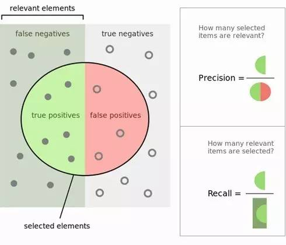

## 精确率与召回率，RoC曲线与PR曲线
　　　　
在机器学习的算法评估中，尤其是分类算法评估中，我们经常听到精确率(precision)与召回率(recall)，RoC曲线与PR曲线这些概念，那这些概念到底有什么用处呢？

首先，我们需要搞清楚几个拗口的概念：

### 1. TP, FP, TN, FN
　　
- True Positives,TP：预测为正样本，实际也为正样本的特征数
　　
- False Positives,FP：预测为正样本，实际为负样本的特征数
　　
- True Negatives,TN：预测为负样本，实际也为负样本的特征数
　　
- False Negatives,FN：预测为负样本，实际为正样本的特征数        

听起来还是很费劲，不过我们用一张图就很容易理解了。图如下所示，里面绿色的半圆就是TP(True Positives), 红色的半圆就是FP(False Positives), 左边的灰色长方形（不包括绿色半圆），就是FN（False Negatives）。右边的 浅灰色长方形（不包括红色半圆），就是TN(True Negatives)。这个绿色和红色组成的圆内代表我们分类得到模型结果认为是正值的样本。

### 2. 精确率(precision),召回率(Recall)与特异性(specificity)

精确率（Precision）的定义在上图可以看出，是绿色半圆除以红色绿色组成的圆。严格的数学定义如下：

$$P = \frac{TP}{TP+FP}$$

召回率(Recall)的定义也在图上能看出，是绿色半圆除以左边的长方形。严格的数学定义如下：

$$R=\frac{TP}{TP+FN}$$

有时也用一个F1值来综合评估精确率和召回率，它是精确率和召回率的调和均值。当精确率和召回率都高时,F1值也会高。严格的数学定义如下：

　　　　2𝐹1=1𝑃+1𝑅 

　　　　有时候我们对精确率和召回率并不是一视同仁，比如有时候我们更加重视精确率。我们用一个参数𝛽来度量两者之间的关系。如果𝛽>1, 召回率有更大影响，如果𝛽<1,精确率有更大影响。自然，当𝛽=1的时候，精确率和召回率影响力相同，和F1形式一样。含有度量参数𝛽的F1我们记为𝐹𝛽, 严格的数学定义如下：

　　　　𝐹𝛽=(1+𝛽2)∗𝑃∗𝑅𝛽2∗𝑃+𝑅 

 

　　　　此外还有灵敏度(true positive rate ,TPR)，它是所有实际正例中，正确识别的正例比例，它和召回率的表达式没有区别。严格的数学定义如下：

　　　　𝑇𝑃𝑅=𝑇𝑃𝑇𝑃+𝐹𝑁 

　　　　另一个是1-特异度(false positive rate, FPR)，它是实际负例中，错误得识别为正例的负例比例。严格的数学定义如下：

　　　　𝐹𝑃𝑅=𝐹𝑃𝐹𝑃+𝑇𝑁 

　　　　我们熟悉了精确率， 召回率和特异性，以及TPR和FPR，后面的RoC曲线和PR曲线就好了解了。

3. RoC曲线和PR曲线
　　　　有了上面精确率， 召回率和特异性的基础，理解RoC曲线和PR曲线就小菜一碟了。

　　　　以TPR为y轴，以FPR为x轴，我们就直接得到了RoC曲线。从FPR和TPR的定义可以理解，TPR越高，FPR越小，我们的模型和算法就越高效。也就是画出来的RoC曲线越靠近左上越好。如下图左图所示。从几何的角度讲，RoC曲线下方的面积越大越大，则模型越优。所以有时候我们用RoC曲线下的面积，即AUC（Area Under Curve）值来作为算法和模型好坏的标准。

　　　　以精确率为y轴，以召回率为x轴，我们就得到了PR曲线。仍然从精确率和召回率的定义可以理解，精确率越高，召回率越高，我们的模型和算法就越高效。也就是画出来的PR曲线越靠近右上越好。如上图右图所示。

　　　　使用RoC曲线和PR曲线，我们就能很方便的评估我们的模型的分类能力的优劣了。

