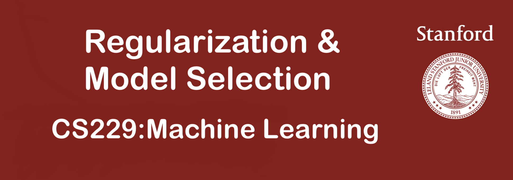

## 1. 模型选择

对于一个学习问题，我们可能有多种模型可以选择，例如：

* 多项式回归中的不同项数对应的模型

* 局部加权回归中不同带宽参数对应的模型

* L1 正则化支持向量机中的不同参数 $C$ 对应的模型

我们希望可以自动选择一个权衡方差与偏差最好的模型。为了更加具体，本节所讨论的模型集合为 **「有限集」** $\mathcal{M}={\mathcal{M_1},...,\mathcal{M_d}}$，向无限集的推广并不难。该模型集合可以是一系列类似的模型（如不同项数的多项式模型），也可以是完全不同的模型（如 SVM、神经网络或逻辑回归）。

## 2. 交叉验证

给定一个训练集 $S$，基于经验风险最小化，我们可以考虑如下的算法进行模型选择：

1. 在 $S$ 上训练每个模型 $M_i$，得到每个模型对应的假设 $h_i$

2. 选择具有最小训练误差的假设

很遗憾，上述算法并不会工作。以多项式模型为例，其项数越高，对训练集的拟合越好，因此上述算法一定会选出高项数且高方差的模型，这并不是一个好的选择。

下面给出一个可以工作的算法：

### 1.「保留交叉验证(hold-out cross validation)」

1. 随机将训练集 $S$ 分为 $S_{train}$（通常用 70\% 的数据）和 $S_{cv}$（剩余的 30%）。$S_{cv}$ 称为 **「保留交叉验证集」**

2. 仅在 $S_{train}$ 上训练每个模型 $M_i$，得到其对应的假设 $h_i$

3. 选择在保留交叉验证集上误差（$\hat{\epsilon_{S_{cv}}}(h_i)$）最小的假设 $h_i$ 作为输出

通过在模型没有训练的 $S_{cv}$ 上进行测试，我们可以更好地估计假设 $h_i$ 的真实泛化误差。

上述算法的第三步也可以用如下方法替代：根据保留交叉验证集选择选择出模型后，再使用全部训练集对模型进行训练。这通常是一个好的主意，除非算法对于数据的初始状态十分敏感，即可能在 $S_{cv}$ 上的训练表现会很差。

保留交叉验证集的缺点是其浪费了很多数据（30%）。虽然我们可以使用全部训练集重新训练模型，但我们仍然只使用了 70% 的数据来找到一个好的模型。如果数据量较大，那么这并没有什么问题，但是如果数据量很小的话，我们应该考虑其他的算法。

### 2.「k 折交叉验证(k-fold cross validation)」方法

这种方法每次保留更少的数据用于验证：

1. 随机将 $S$ 分为 $k$ 个互斥的子集，每个子集中含有 $m/k$ 个训练样本，我们称之为子集 $S_1,...,S_k$

2. 对于每个模型 $M_i$，按照如下步骤进行分析:$\text{For} \quad j=1,...,k$，在除去子集 $S_j$ 上的训练集上训练每个模型，得到对应的假设 $h_{ij}$；在 $S_j$ 上测试假设 $h_{ij}$，得到 $\hat{\epsilon_{S_j}}(h_{ij})$；模型 $M_i$ 的估计泛化误差通过求 $\hat{\epsilon_{S_j}}(h_{ij})$ 的平均得到

3. 选择具有最小估计泛化误差的模型 $M_i$，然后在整个训练集上重新训练，得出的结果即为我们的最终假设

与保留交叉验证相比，该方法需要训练每个模型 $k$ 次，计算代价更高。对于 $k$ 一个经典的选择是 $k=10$。在某些样本量很小的情况下，我们会选择 $k=m$，这种方法被称为 **「留一交叉验证(leave-one-out cross validation)」**。

### 3. 留一交叉验证（Leave-one-out Cross Validation）

它是第二种情况的特例，此时S等于样本数N，这样对于N个样本，每次选择N-1个样本来训练数据，留一个样本来验证模型预测的好坏。此方法主要用于样本量非常少的情况，比如对于普通适中问题，N小于50时，我一般采用留一交叉验证。

通过反复的交叉验证，用损失函数来度量得到的模型的好坏，最终我们可以得到一个较好的模型。那这三种情况，到底我们应该选择哪一种方法呢？一句话总结，如果我们只是对数据做一个初步的模型建立，不是要做深入分析的话，简单交叉验证就可以了。否则就用K折交叉验证。在样本量少的时候，使用K折交叉验证的特例留一交叉验证。

此外还有一种比较特殊的交叉验证方式，也是用于样本量少的时候。叫做自助法(bootstrapping)。比如我们有m个样本（m较小），每次在这m个样本中随机采集一个样本，放入训练集，采样完后把样本放回。这样重复采集m次，我们得到m个样本组成的训练集。当然，这m个样本中很有可能有重复的样本数据。同时，用没有被采样到的样本做测试集。这样接着进行交叉验证。由于我们的训练集有重复数据，这会改变数据的分布，因而训练结果会有估计偏差，因此，此种方法不是很常用，除非数据量真的很少，比如小于20个。

虽然我们介绍各种不同的交叉验证作为模型选择的方法，但其也可以用来评估单个模型或算法的性能.